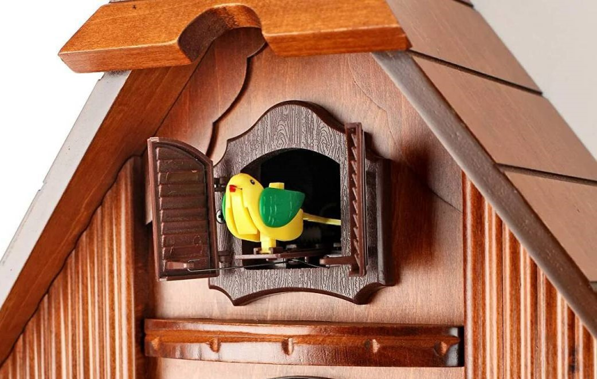
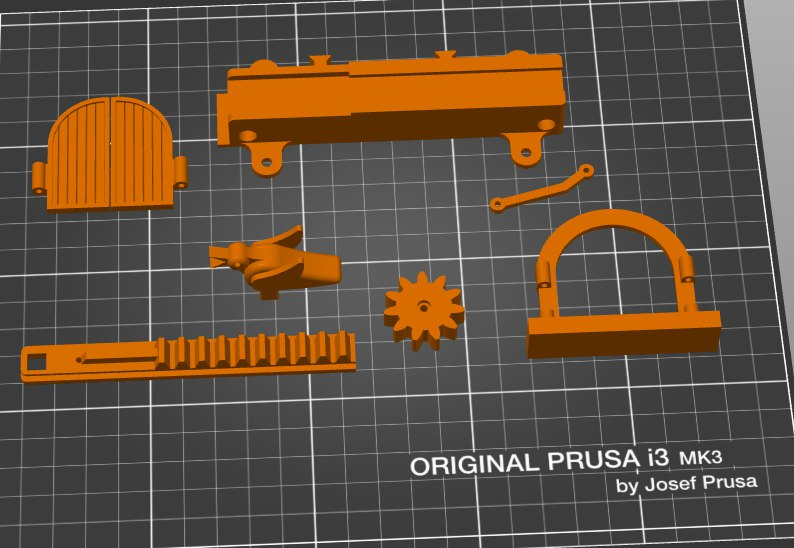
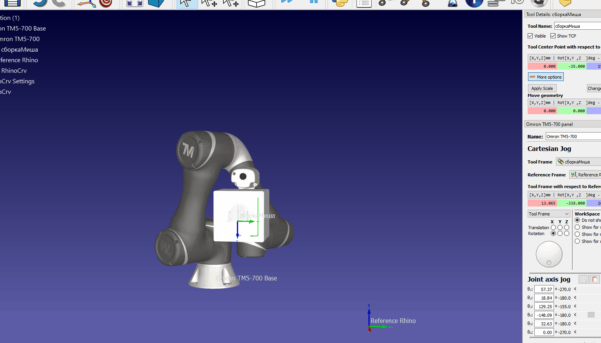

# Robot-Head
### Исследование
**Цели и задачи** - Проектирование насадки на роборуку Omron tm5-700.
Перед нами была поставлена задача проектирования, создания и симуляции насадки для роборуки. В процессе поисков вариантов и согласования идей с преподавателем, итоговый вариант представлял выполнения "кукушки" как в настенных часах. В процессе поиска вариантов внешнего вида и выполнения в интернете, было выбрано стандартное исполнение с выступающей птицей из-за дверок.



В ходе исследования была выбрана концепция максимальной стандартизации и разбиения деталей на составляющие. Таким образом в случае неисправностей деталей, появления новых идей, влекущих изменение конфигурации сборки, время и количество изготавливаемых деталей заново было бы минимально. Данная концепция неизбежно влекла за собой ухудшение и/или игнорирование внешнего вида насадки.

Основой для насадки был выбран корпус квадратной формы из фанеры, так как соединение пазами не предоставляла достаточной прочности конструкции, соединения с использованием клея шли вразрез концепции, было решено использовать уголки с винтовым креплением. 4 стенки из 6 были выполнены одинаково, а уголки в последствии также использовались как опоры для перегородки с направляющей "кукушки". Для удобства крепления сборки на «руку» компоненты пришлось опустить ниже, соответственно сделать насадку выше, но это позволило выполнить разделение управляющих компонентов с питанием и движущих частей.


Для движения птицы использовалась зубчатая передача, была спроектирована система из направляющей, шестеренки, основания для утки, петель, дверок и рамы дверок, чьи модели можно найти в папке CAD.



В качестве системы для управления и движения птицы была выбрана система с пультом управления и написана управляющая программа:

```C++
#include <IRremote.hpp>

#define IR_BUTTON_OK 28
#define IR_RECEIVE_PIN 3
#define SPEED_1      5 
#define DIR_1        4
 
void setup(){
  Serial.begin(9600);
  IrReceiver.begin(IR_RECEIVE_PIN);
  for (int i = 4; i < 8; i++) {     
    pinMode(i, OUTPUT);
  }
}

void loop(){
   if (IrReceiver.decode()) {
      IrReceiver.resume(); // Enable receiving of the next value
      Serial.println(IrReceiver.decodedIRData.command);
      int command = IrReceiver.decodedIRData.command;
      
      switch (command) {
        case IR_BUTTON_OK: {
          digitalWrite(DIR_1, LOW); // set direction
          analogWrite(SPEED_1, 120); // set speed
          delay(600);
          analogWrite(SPEED_1, 0);
          delay(2000);
          analogWrite(SPEED_1, 120);
          digitalWrite(DIR_1, HIGH);
         // ждём одну секунду
          delay(600);
          // выключаем первый мотор
         analogWrite(SPEED_1, 0);

          
          break;
        }
      
      }
  }
}
```

В коде нет отсчета для проигрывания движения, оно выполняется после нажатия на кнопку, так как мне не нравится идея диктовки временем, когда случится какое-то событие, хотелось хотя бы в проекте самому решать, когда настанет этот момент.

**Используемое оборудование и программы**: плата Arduino Uno, драйвер Motorshield, блок питания, "моторчик", сенсор ИК излучения, провода, винты М3-8, 3D-принтер Prusa i3 MK3, Лазерный станок GCC Spirit GLS100,  SolidWorks, CorelDraw

**Методы изготовления**: Для корпуса и перекладины было выбрано использование фанеры и его вырезание на лазере (про существование акрила было забыто), уголки и прочие составляющие "кукушки" (птица, направляющая, петли, дверки итд) было решено создать на 3Д принтере, благодаря их относительно малому размеру наибольшее время печати было 28 минут на скорости 100%.


Общая сборка как и все прочие детали были выполнены в программе SolidWorks

### Производство
В ходе изготовления сначала была выполнена наладочная партия деталей и было выявлено ряд недочетов: недостаточный диаметр отверстий в уголке, неточное расположение отверстий в корпусе и непродуманное расположение проводов. Благодаря выбранной концепции, ошибки были быстро выявлены и исправлены, что не сильно сказалось на графике производства


На рисунке выше представлена сборка основных напечатанных и всех электронных деталей сборки. В перегородке (на котором закреплен мотор и направляющая) были выполнены отверстия для прохождения проводов моторчика и проводов сенсора сигналов, который закреплен на внешней стороне корпуса.


### Тестирование

GIF симуляция работы манипулятора:


Видео работы насадки и манипулятора:
[

## Недочеты
 1. Из-за выбранной концепции был отброшен вопрос эстетического вида и дизайна в целом
 2.	Недостаточная фиксация мотора в сборке из-за чего движение механизма не может гарантироваться постоянно. Но появляется вопрос с созданием дополнительного механизма для подвода и отвода шестеренки к зубчатому основанию
 3.	Из-за чувствительности сенсора и кнопки на пульте управления, иногда бывает двойное повторение программы
    
